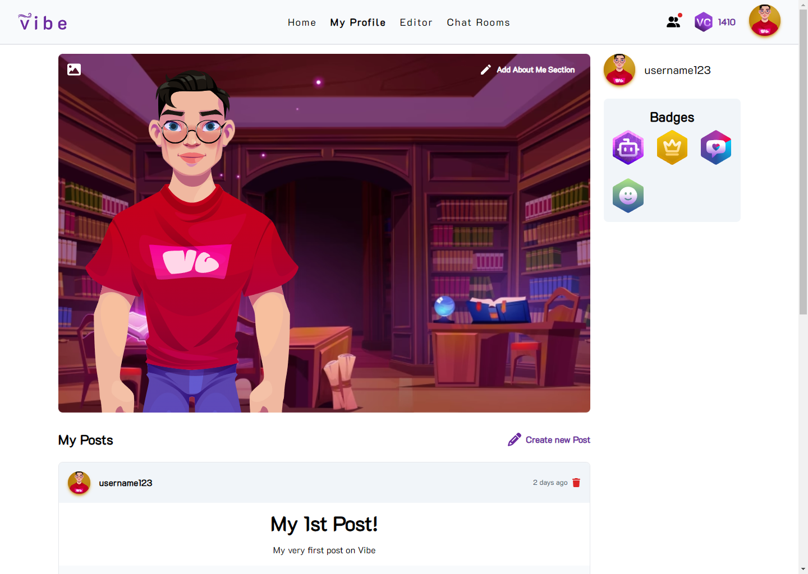
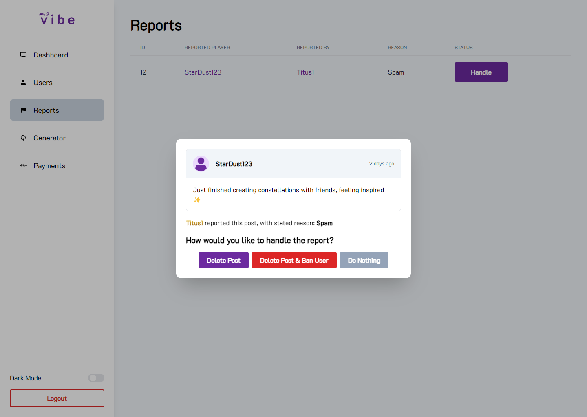

<br><br>

<!-- project philosophy -->


> An immersive social media website that is focused on user interaction and community engagement.
>
> Vibe is a place for immersive social experiences, focusing on genuine connections and community engagement. It offers a space for users to escape life's hardships, relax, and connect through customizable 2D avatars. We believe in creating a vibrant digital ecosystem where every interaction is valued, celebrated, and cherished.

### User Stories

- As a user, I want to create and customize my own 2D avatar on Vibe to reflect my personality and preferences. By personalizing my avatar's appearance and style, I can express myself creatively.
- As a user, I want to unwind and relax on Vibe, escaping from the stresses of daily life. Whether it's through casual chats with friends, participating in fun activities, or joining chat rooms.
- As a user, I want to be able to report inappropriate content that might appear on my feed to keep my experience fun and stress-free.

### Premium User Stories

- As a Premium user, I want to have access to exclusive and advanced 2D avatar items so that I can stand out within the community.
- As a Premium user, I want priority access to new features and updates to experience the latest enhancements before regular users.
- As a Premium user, I want the ability to customize my profile theme and layouts for a more personalized experience.

### Admin Stories

- As an admin, I want to manage users on Vibe, and ban them if they break the rules to maintain a safe and respectful community.
- As an admin, I want to handle user reports to ensure that the website remains free of inappropriate or harmful content.

<br><br>

<!-- Tech stack -->


### Vibe is built using the following technologies:

- **Frontend**: The website uses Next.js, a powerful React framework that enables server-side rendering and static site generation, providing improved performance and SEO benefits.
- **Backend**: The backend API is developed with Laravel, a robust PHP framework known for its elegant syntax, comprehensive feature set, and excellent community support, making it easy to build secure and scalable applications.
- **Styling**: For styling, the project utilizes Tailwind CSS, a utility-first CSS framework that allows for rapid UI development with a consistent design. Additionally, a custom mini library was created for reusable components like buttons and inputs, designed from scratch to match the project's unique aesthetic.
- **Database**: The application uses MySQL for persistent storage, a reliable and widely-used relational database management system that ensures data integrity and efficient query performance.
- The app uses the font ["K2D"](https://fonts.google.com/specimen/K2D) as its main font.

<br><br>

<!-- UI UX -->


> We designed Vibe using wireframes and mockups, iterating on the design until we reached the ideal layout for easy navigation and a seamless user experience.

- Project Figma design [figma](https://www.figma.com/design/F42tfEE6pkzNUUWrREZiRA/Vibe?node-id=0%3A1&t=AS2pMfyGeiuoAQkt-1)

### Mockups

| Home Screen                                   | Character Creator Screen                    |
| --------------------------------------------- | ------------------------------------------- |
|  |  |

<br><br>

<!-- Database Design -->


### Architecting Data Excellence: Innovative Database Design Strategies:


<br><br>

<!-- Implementation -->


### User Screens (Web)

| Login Screen                          | Register Screen                         | Feed Screen                                |
| ------------------------------------- | --------------------------------------- | ------------------------------------------ |
|    |  |             |
| Character Editor Screen               | Profile Screen                          | Chat Rooms Screen                          |
|    |    |  |
| Premium Screen                        |
|  |

### Admin Screens (Web)

| Dashboard Screen                                | Reports Screen                         |
| ----------------------------------------------- | -------------------------------------- |
|  |  |

<br><br>

<!-- Prompt Engineering -->


### Mastering AI Interaction: Unveiling the Power of Prompt Engineering:

- This project utilizes advanced prompt engineering techniques to optimize interactions with natural language processing models. By skillfully crafting input instructions, we tailor the behavior of the models to achieve precise and efficient language understanding and generation for various tasks and preferences.

In Vibe, the OpenAI API is employed to create 2D human-like characters. A custom prompt is designed to help the AI understand the appearance of each body part, enabling it to generate high-quality avatars.


<br><br>

<!-- AWS Deployment -->


### Efficient AI Deployment: Unleashing the Potential with AWS Integration:

- This project leverages AWS deployment strategies to seamlessly integrate and deploy natural language processing models. With a focus on scalability, reliability, and performance, we ensure that AI applications powered by these models deliver robust and responsive solutions for diverse use cases.

<br><br>

<!-- Unit Testing -->


### Precision in Development: Harnessing the Power of Unit Testing:

- This project employs rigorous unit testing methodologies to ensure the reliability and accuracy of code components. By systematically evaluating individual units of the software, we guarantee a robust foundation, identifying and addressing potential issues early in the development process.

For Vibe, the following testing frameworks are utilized:

- **Laravel**: Utilizes Laravel's built-in Unit and Feature Testing to ensure the backend API is robust and functions as expected. These tests help verify the correctness of each component, from individual methods to the overall integration of the application.
- **Next.js**: Utilizes Jest for testing the frontend components. Jest provides a comprehensive and flexible testing framework, allowing for the thorough examination of React components, ensuring they render correctly and behave as intended.

| Laravel Tests                                | Next.js/Jest Tests                             |
| -------------------------------------------- | ---------------------------------------------- |
|  |  |

<br><br>

<!-- How to run -->


> To set up Vibe locally, follow these steps:

### Prerequisites

Before installing and setting up Vibe, ensure you have the following prerequisites installed on your system:

- Node.js and NPM: Ensure you have Node.js and NPM installed. You can download and install them from [nodejs.org](https://www.nodejs.org).
- Composer: Composer is required for managing PHP dependencies. You can download and install it from [getcomposer.org](https://getcomposer.org).
- PHP: Make sure you have PHP version 8.2 or higher installed, since Vibe uses Laravel 11. You can download the latest version from [php.net](https://php.net).
- MySQL: MySQL is required for the database. You can download and install it from [mysql.com](https://mysql.com).
- For the Google OAuth Login to work, you'll need to obtain OAuth credentials from Google. You can read more here: [https://developers.google.com/identity/protocols/oauth2](https://developers.google.com/identity/protocols/oauth2)
- To accept payments for Premium membership, create an account on [Stripe](https://www.stripe.com) and take note of your API keys.
- For the chat rooms to work, create an account on [Pusher](https://www.pusher.com) and take note of your API keys.
- For the AI Character Generator, you will need an [OpenAI API Key](https://platform.openai.com/api-keys).

### Installation

1. Clone the repo:
   ```sh
   git clone https://github.com/anthonytoumaibrahim/vibe.git
   ```
2. Navigate to the project repository:
   ```sh
   cd vibe
   ```

#### Frontend Setup

1. Navigate to the frontend directory:
   ```sh
   cd frontend
   ```
2. Install NPM packages:
   ```sh
   npm install
   ```
3. Copy the example environment variables file `.env.local.example` and rename it as `.env.local`, either manually or through this command:
   ```sh
   cp .env.local.example .env.local
   ```
4. Fill out the information in `.env.local` with your configuration details:
   - `NEXT_PUBLIC_URL`: The URL of the backend server.
   - `NEXT_PUBLIC_API_URL`: The URL of the API.
   - `NEXT_PUBLIC_PUSHER_KEY`: Your [Pusher](https://pusher.com/) key. Pusher is needed for the chat rooms.
   - `NEXT_PUBLIC_PUSHER_CLUSTER`: Your [Pusher](https://pusher.com/) cluster, e.g `ap1`.
   - `NEXT_PUBLIC_GOOGLE_OAUTH_CLIENT_ID`: Your Google OAuth client ID.
5. To run the frontend in development mode:
   ```sh
   num run dev
   ```

#### Backend Setup

1. Navigate to the backend directory:
   ```sh
   cd backend
   ```
2. Install Composer dependencies:
   ```sh
   composer install
   ```
3. Copy the example environment variables file `.env.example` and rename it as `.env`, either manually or through this command:
   ```sh
   cp .env.example .env
   ```
4. Fill out the information in `.env` with your configuration details, including the database connection settings. You should also provide the following to ensure full functionality:
   - `OPENAI_API_SECRET`: Your [OpenAI API Secret Key](https://platform.openai.com/api-keys). This is used for the AI Character Generator, and more.
   - `STRIPE_KEY`: To accept payments for the Premium service, you need a [Stripe API Publishable Key](https://dashboard.stripe.com/test/apikeys).
   - `STRIPE_SECRET`: The Stripe Secret key.
   - `STRIPE_WEBHOOK_SECRET`: The [Stripe Webhook Key](https://dashboard.stripe.com/test/webhooks).
   - As mentioned earlier, the `PUSHER_APP_*` variables are required for Chat Rooms. You can get them from [Pusher](https://pusher.com/).
5. Run the following commands:
   ```sh
   php artisan key:generate
   php artisan jwt:secret
   php artisan storage:link
   php artisan migrate
   ```
6. To serve the backend, run:
   ```sh
   php artisan serve
   ```
